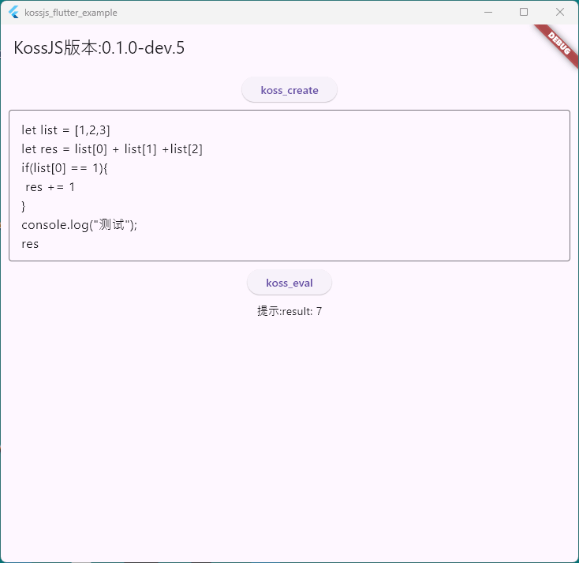

# kossjs_flutter

## 特性

- [x] 支持Windows
- [ ] 支持Android

- [x] 支持Harmony

- [ ] 支持Linux

- [ ] 支持Mac

- [ ] 支持ios

## 预览

| 平台    | 页面                                                              |
| ------- |-----------------------------------------------------------------|
| Windows |  |
| Android | 待补充                                                             |
| Harmony |  |
| Linux   | 待补充                                                             |
| Mac     | 待补充                                                             |
| ios     | 待补充                                                             |

