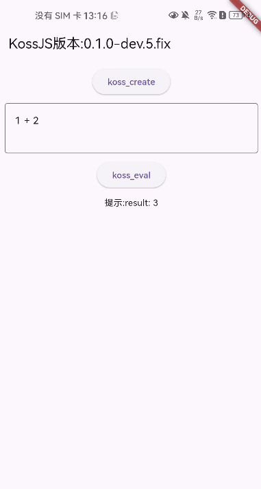

# kossjs_flutter

https://github.com/KossJS/KossJS

KossJS 是一个基于 [Boa](https://github.com/boa-dev/boa) 引擎构建 JavaScript 运行时,为您的应用快速赋予安全、高效的脚本执行能力。可用于插件系统、游戏脚本引擎等。

## 特性

- [x] 支持Windows
- [x] 支持Android

- [x] 支持Harmony

- [ ] 支持Linux

- [ ] 支持Mac

- [ ] 支持ios

## 预览

| 平台    | 页面                                                              |
| ------- |-----------------------------------------------------------------|
| Windows |  |
| Android |  |
| Harmony |  |
| Linux   | 待补充                                                             |
| Mac     | 待补充                                                             |
| ios     | 待补充                                                             |

